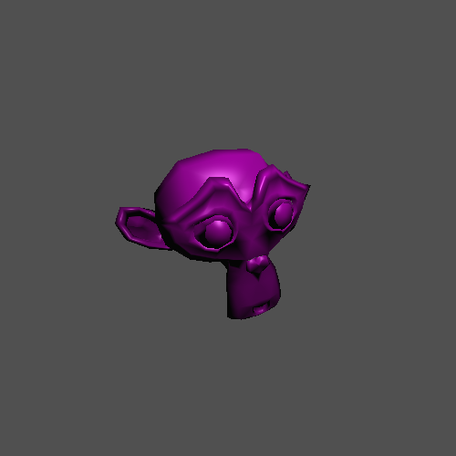
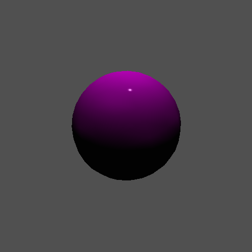

[](https://classroom.github.com/a/GSOGPGNx)
# Programming Assignment 7

Class: CS 4204 (Computer Graphics), Fall 2024

Professor: Brendan David-John

## Overview

In this programming assignment, you are going to complete the seventh step needed to render a 3D mesh, smooth shading! 
You will be extending the render loop in `Renderer` to compute `phong` shading, which requires modifying the `Mesh` 
class to calculate vertex normals. The render loop will also incorporate specular shading into the Lambertian 
reflection equation.

## Instructions
The render loop function signature will not change for this assignment. However, a new render mode will be added: 
"phong". When "phong" is passed as the first argument to the render method, the renderer will produce a smooth 
shaded image where the normal vector used in the lighting calculations is interpolated from the face's vertex normals. Specifically, the Phong lighting equations from the class shading lectures should be implemented, in which the reflect vector R is used to compute the specular lighting component, as defined in week8_shading_2.pdf. In addition, you should add the specular shading component to the lighting calculations, making use of the specular coefficient and specular color values present in the `Mesh` class.

This assignment will make use of visual checks to validate your solutions, and one unit test to ensure you inverse_project_point is correct for the PerspectiveCamera.

### Output

There are a total of 6 scripts that can be executed. `extracredit.py` is what will be run to evaluate the extra 
credit. The lone unit test will be exected by running `pytest -v assignment7.py`:


The renderings scripts are: `assignment7_perspective`, `assignment7_ortho`, `assignment7_phong_high`, `assignment7_phong_low`. The following visual outputs are expected:

Perspective:



Ortho:


Phong High Coefficient:



Phong Low Coefficient:


NOTE: As a reminder, please commit all files necessary for your code to run (including the extra credit) so that I can execute your code while grading.

### Dependency Management
Each assignment will include a requirements.txt file that includes the python package requirements for the assignment. If you are using PyCharm it should automatically detect and install the dependencies when you create the virtual environment. Otherwise, [these instructions](https://www.jetbrains.com/help/pycharm/managing-dependencies.html#configure-requirements) will help you manually manage the requirements in PyCharm. If you are using something other than PyCharm, you can use the command line to manually install the packages from the requirements.txt file:

```bash
pip install -r requirements.txt
```

## Updates to the `Mesh` class

### Exposed Members

#### `vertex_normals`
In order to smoothly interpolate between vertex normals, we need to compute the vertex normals when the mesh is 
instantiated. For each vertex, identify all faces that use that vertex, and calculate the average of their normals. 
This average normal will be the vertex normal. Note that the indexing of `vertex_normals` and `verts` should be the 
same, that is that the vertex normal at `vertex_normals[i]` should be the vertex normal for the vertex at `verts[i]`.

## Update to the `Renderer` class

### Updated Methods

#### `render(self, shading, bg_color, ambient_light)`
The method signature remains unmodified. However, a new valid method of shading, `phong`, should be introduced. 
That is, when the string "phong" is passed in as the `shading` parameter, the output image should be shaded using 
the Phong method.

## Extra Credit
Extra credit for this assignment will be to add a `gouraud` shading mode. Recall that the difference between flat, 
Gauraud, and Phong shading is what values are interpolated for each fragment. Phong shading interpolates the vertex normals to perform lighting at the fragment (pixel) level. Gouraud shading calculates lighting as color values for each vertex 
before the fragment stage, and then interpolates these colors during the fragment stage. This still provides a smooth 
shading result, at a much lower computational cost compared to Phong shading, but can result in specular shading 
artifacts. The extra credit will be validated by running `extracredit.py` and comparing the 
resulting rendering with the expected output below.


## Rubric
There are 20 points (22 with extra credit) for this assignment:
- *4 pts*: pytest test_inverse_project_point passed
- *16 pts*: The Phong shaded renderings produced from the assignment7_* scripts are rendered as expected.
  - *4 pts*: `assignment7_perspective`
  - *4 pts*: `assignment7_ortho`
  - *4 pts*: `assignment7_phong_high`
  - *4 pts*: `assignment7_phong_low`

